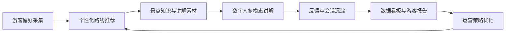
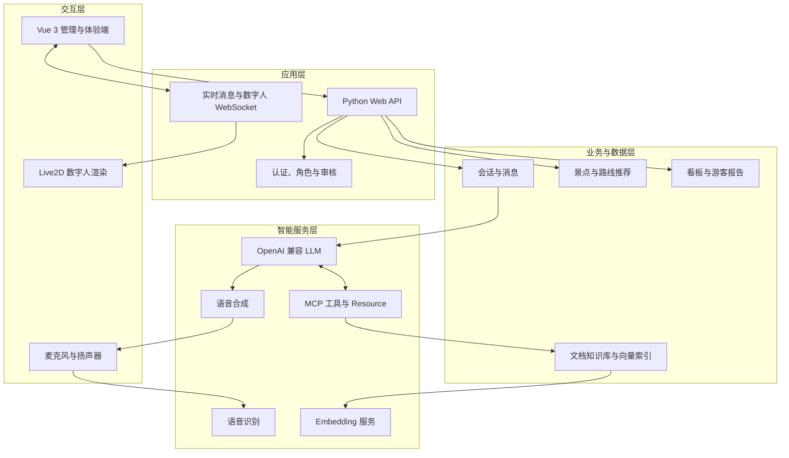

<p align="center">
  
</p>

<h1 align="center">境语AI</h1>

<p align="center">
  面向智慧文旅场景的多模态数字人导览与运营平台
</p>

<p align="center">
  <a href="#快速开始"></a>
  <a href="#技术架构"></a>
  <a href="#技术架构"></a>
  <a href="#mcp-与知识库"></a>
  <a href="LICENSE"></a>
</p>

境语AI将数字人交互、文旅路线推荐、景区数据分析、游客报告、知识库检索与 MCP 工具调用整合在同一套平台中。普通用户可以通过文本、语音和图片完成咨询，系统结合大模型、景区知识与实时工具生成回答，并通过数字人进行语音播报；管理员负责维护路线、知识库、数字人和用户数据，形成从游客服务到运营分析的完整闭环。

## 平台亮点

| 能力 | 普通登录用户 | 管理员 |
| --- | --- | --- |
| 多模态交互 | 文本、语音、图片问答与会话历史 | 连续语音、麦克风和扬声器配置 |
| 数字人讲解 | 当前数字人展示、语音播报与口型驱动 | 数字人搜索、预览、切换和资源管理 |
| 路线推荐 | 根据兴趣、时长和同行人生成主路线与备选路线 | 维护景点、路线模板、停靠点、讲解素材和推荐策略 |
| 智慧看板 | 查看景区指标、趋势和智能解读 | 数据重新导入、游客感受度与运营洞察 |
| 游客报告 | 无独立管理入口 | 生成、查看、导出报告并维护建议处理状态 |
| 知识增强 | 在对话中使用管理员已启用的知识与实时工具 | 上传文档、建立索引、执行 RAG 查询和管理 MCP 工具 |
| 用户体系 | 注册、登录、个人资料和密码管理 | 用户、角色、状态、密码重置及审核日志管理 |

## 业务闭环



境语AI不是单一聊天页面，而是一套围绕文旅服务流程构建的应用系统：推荐结果可以进入讲解场景，游客互动可以沉淀为分析数据，运营策略又可以继续改善下一次推荐。

## 核心功能

### 多模态对话与数字人

- 支持文本、手动语音和图片消息。
- 支持会话创建、切换、重命名、删除和历史记录。
- 支持消息选择、分享图预览与下载。
- 支持 TTS 语音合成、数字人播报和跨平台口型数据生成。
- 支持管理员管理数字人资源并切换当前激活形象。

### 智慧路线推荐

- 根据兴趣主题、游览时长、同行人员和游览强度保存游客偏好。
- 同时生成主路线和备选路线，并展示停靠点与讲解内容。
- 支持复制讲解话术、打印、JSON 导出及采纳或拒绝反馈。
- 提供景点、路线模板、停靠点、讲解素材和推荐策略维护工作台。
- 支持推荐数据导入导出和推荐日志查询。

### 数据看板与游客报告

- 展示客流、服务、景点和体验趋势等指标。
- 支持景区切换、条件筛选、智能解读和语音播报。
- 管理员可以根据游客会话与行为生成结构化游客报告。
- 游客报告支持导出、运营建议维护和处理状态跟踪。

### MCP 与知识库

- 管理 MCP 服务连接、工具状态和 Resource 注入开关。
- 支持天气、课程知识、日程等工具按需接入。
- 支持知识库文件上传、删除、状态检查和增量索引。
- 支持基于 OpenAI 兼容 Embedding API 的文档向量化与 RAG 查询。
- 支持重建索引，并对破坏性管理操作进行权限隔离。

## 技术架构



### 技术栈

| 层级 | 主要技术 |
| --- | --- |
| 前端 | Vue 3、TypeScript、Vite、Element Plus、Pinia、ECharts、GSAP |
| 后端 | Python 3.12、Flask、WebSocket |
| 智能服务 | OpenAI 兼容 LLM、ASR、TTS、Embedding API |
| 工具生态 | Model Context Protocol、RAG、可配置 MCP Server |
| 数字人 | Live2D Cubism SDK for Web、音频驱动口型 |
| 部署 | Python 虚拟环境、Node.js 构建、Docker Compose TTS |

## 项目结构

| 目录 | 职责 |
| --- | --- |
| `main.py`、`core/`、`gui/` | 应用入口、业务服务、认证和 Web API |
| [前端源码目录](./fay-frontend/) | Vue 3 管理与体验端 |
| [MCP 管理模块](./faymcp/) | MCP 管理、工具注册和知识库路由 |
| `mcp_servers/` | 天气、课程知识、日程等 MCP 服务 |
| `llm/`、`asr/`、`tts/` | 大模型、语音识别和语音合成适配 |
| `deploy/`、`config/`、`utils/` | 部署样例、配置辅助和通用能力 |

运行时生成的知识库、日志、缓存、模型和用户数据不属于源码，不应直接提交到公开仓库。

## 快速开始

### 环境要求

- Python 3.12
- Node.js 20 及 npm（推荐环境）
- Windows、macOS 或 Linux；服务器部署已在 Ubuntu 22.04 上验证
- Docker 与 Docker Compose，仅在使用容器化 TTS 时需要
- Ubuntu 需要安装 `build-essential` 和 `portaudio19-dev`

### 1. 创建 Python 虚拟环境

Windows PowerShell：

```powershell
python -m venv .venv
.\.venv\Scripts\Activate.ps1
python -m pip install --upgrade pip
pip install -r requirements.txt
```

Ubuntu 或 macOS：

```bash
python3.12 -m venv .venv
source .venv/bin/activate
python -m pip install --upgrade pip
pip install -r requirements.txt
```

### 2. 创建本地配置

Windows PowerShell：

```powershell
Copy-Item system.conf.bak system.conf
```

Ubuntu 或 macOS：

```bash
cp system.conf.bak system.conf
```

在 `system.conf` 中配置实际使用的 LLM、ASR、TTS 和 Embedding 服务。项目支持 OpenAI 兼容接口，真实 API Key 只应保存在本地配置中。

`config.json` 中的管理员初始密码是公开占位值，不应替换为长期密码后提交。首次启动必须仅限本机访问；启动后使用其中的初始账号登录，立即在个人设置或用户管理中修改密码。管理员写入数据库后，后续启动不会根据配置重复创建。

### 3. 构建前端

进入上方链接的“前端源码目录”，然后执行：

```bash
npm ci
npm run build
```

构建完成后返回项目根目录。

### 4. 启动应用

```bash
python main.py start
```

启动后访问：

```text
http://127.0.0.1:5000
```

### 5. 可选：启动容器化 TTS

```bash
docker compose -f deploy/tts/docker-compose.yml up -d
```

该服务默认只监听 `127.0.0.1:8080`，由主程序通过 OpenAI 兼容接口调用。

### 本地服务端口

| 端口 | 用途 | 建议 |
| --- | --- | --- |
| `5000` | 应用页面与主要 API | 本地访问入口 |
| `5010` | MCP 管理与知识库 API | 仅供应用内部访问 |
| `10002` | 数字人实时消息 WebSocket | 按 renderer 部署方式限制访问 |
| `10003` | 前端实时数据 WebSocket | 由前端连接 |
| `8080` | 可选容器化 TTS | 默认仅监听 `127.0.0.1` |

### 前端开发模式

进入“前端源码目录”并安装依赖后执行：

```bash
npm run dev
```

开发环境由 Vite 将普通 API 转发到应用服务，并将 MCP 与知识库请求转发到 MCP 管理服务。具体目标地址可通过前端环境变量调整。

## 配置说明

| 配置类别 | 说明 |
| --- | --- |
| LLM | 模型名称、OpenAI 兼容 Base URL 和 API Key |
| ASR | 语音识别模式、模型和服务凭据 |
| TTS | 合成模块、音色、Base URL 和音频格式 |
| Embedding | 向量模型、Base URL 和 API Key |
| MCP | 服务命令、连接方式、工具及 Resource 状态 |
| 数字人 | renderer 地址、模型资源目录和 WebSocket 地址 |

仓库提供 `system.conf.bak` 作为配置样例。`system.conf`、`.env`、真实凭据和个人运行数据已经或应当保持在 Git 忽略范围内。

## 源码与资源边界

为避免公开分发未经授权的模型、数据和凭据，以下内容不随 GitHub 源码仓库提供：

- Live2D renderer 与数字人模型资源。
- 景区原始知识文档、课程包和旅游数据集。
- 已建立的向量索引、会话记录和用户数据库。
- 推荐路线的私有初始化数据。
- API Key、服务器凭据和生产环境配置。

比赛或完整功能部署可以通过独立资源包补充已获授权的模型与数据，并保持项目约定的相对目录结构。实际交付范围和许可限制以 [THIRD_PARTY_NOTICES.md](THIRD_PARTY_NOTICES.md) 为准。

## 安全说明

- 不要提交 `system.conf`、`.env`、API Key、访问令牌、服务器凭据、虚拟环境、依赖目录、构建产物、日志、缓存或生成音频。
- 不要在公开仓库中分发未经授权的数字人模型、课程材料和数据集。
- 生产环境应修改默认管理员密码，并限制应用、MCP、TTS 和 renderer 的网络暴露范围。
- 知识库重建、数据重新导入、用户停用和删除属于高风险管理操作，应仅授予管理员。

## 第三方组件与许可

本项目使用 Live2D Cubism SDK for Web 实现数字人模型渲染和口型驱动。Cubism SDK、Cubism Core、示例模型及相关知识产权归 Live2D Inc. 及相应权利人所有。项目不将第三方角色设计、模型制作或示例动作声明为自主原创成果。

> This content uses sample data owned and copyrighted by Live2D Inc.
> The sample data are utilized in accordance with terms and conditions set by Live2D Inc.
> This content itself is created at the author's sole discretion.

境语AI在开源数字人基础框架上进行二次开发。参赛成果重点聚焦智慧文旅业务流程、路线推荐、数据看板、游客报告、多用户权限、知识库与 MCP 管理、跨平台口型适配，以及这些能力在统一前后端中的集成。基础框架、第三方组件和素材来源不计入团队原创成果，详细继承范围见第三方声明。

完整的第三方组件、模型来源与使用边界见 [THIRD_PARTY_NOTICES.md](THIRD_PARTY_NOTICES.md)。源码许可见 [LICENSE](LICENSE)。
